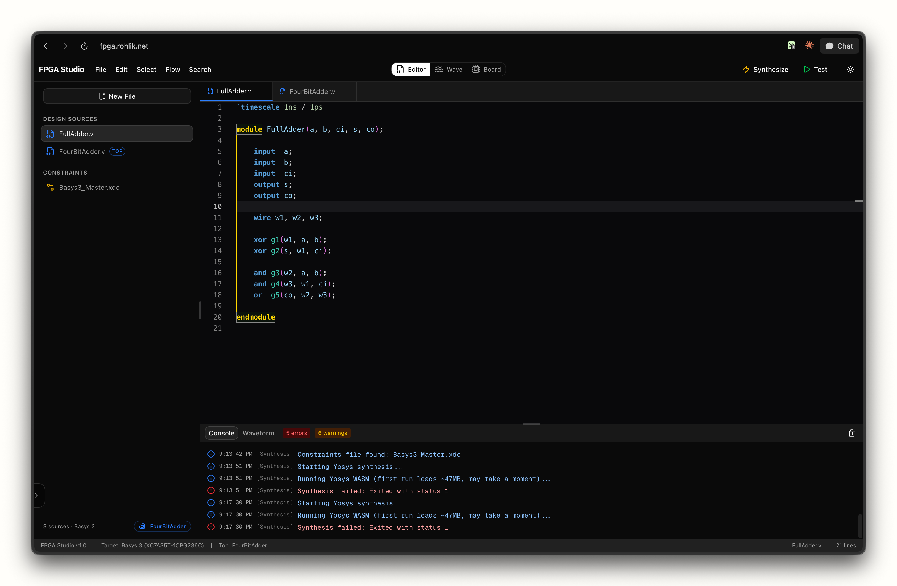
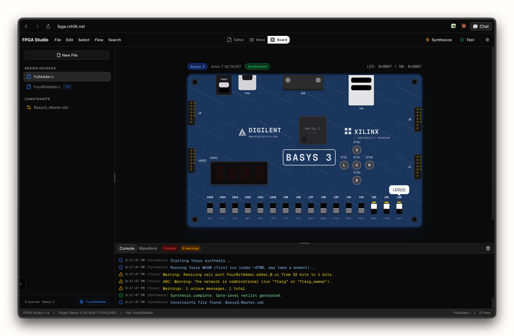
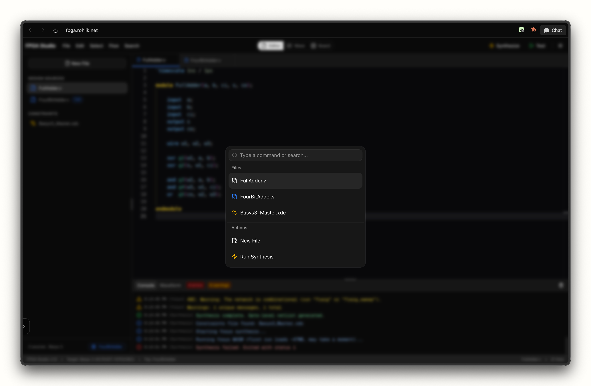

# FPGA Studio

A web-based FPGA development environment with a Verilog editor, Yosys synthesis, behavioral simulation, and interactive Basys 3 board emulation — all running in the browser.



## Features

- **Verilog Editor** — Syntax highlighting, autocomplete, and error reporting for Verilog HDL
- **Yosys Synthesis** — Run Yosys via WebAssembly to synthesize gate-level netlists directly in the browser
- **Behavioral Simulation** — Execute testbenches and view results in a waveform viewer
- **Basys 3 Board Emulation** — Interactive board view with switches, LEDs, buttons, and 7-segment displays driven by synthesized netlists
- **Command Palette** — Quick access to files, actions, and settings via `Cmd+K`
- **Project Management** — Import/export projects, multi-file support with design sources, testbenches, and constraints





## Start Locally

```bash
npm install
npm run dev
```

Open [http://localhost:3000](http://localhost:3000) in your browser.

## Stack

- [Next.js](https://nextjs.org) / React
- [Monaco Editor](https://microsoft.github.io/monaco-editor/) for code editing
- [Yosys WASM](https://github.com/nickmccurdy/yosys.js) for synthesis
- [shadcn/ui](https://ui.shadcn.com) component library
- Tailwind CSS
