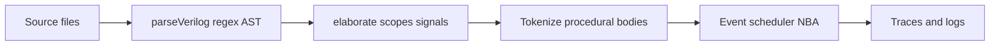

# Verilog implementation: coverage gap report

This document describes how Verilog is analyzed in this repository, what is intentionally supported, and gaps relative to Verilog-2005 (and common SystemVerilog) expectations. It reflects `src/lib/verilog-parser.ts` and `src/lib/verilog-simulator.ts` as of the audit date.

## How analysis works (pipeline)

1. **Structural parsing** (`verilog-parser.ts`): comment stripping, regex extraction of `module`/`endmodule`, then piecemeal regex parsers for ports, wires, regs, assigns, `always`/`initial`, gate primitives, instances, and a **narrow** `generate for` unroller.
2. **Behavior** (`verilog-simulator.ts`): tokenizer/parser for expressions and procedural statements inside `initial`/`always` bodies and `assign` RHS; event-driven scheduler with active vs NBA (non-blocking assign) region; continuous assigns and `always @(*)` implemented via **subscriber callbacks** on signal/memory changes.

The simulator header comments state intent: enough Verilog-2005 for typical **educational** testbenches. The sections below list what lies outside that slice.

---

## A. Reasonably well-covered baseline

For orientation (not exhaustive): scalar/vector `wire`/`reg`, `integer`, continuous `assign` (with optional delay), gate primitives `and`, `or`, `xor`, `not`, `nand`, `nor`, `xnor`, `buf`, `initial`/`always` with `@(posedge|negedge|*` or explicit list), blocking/`<=`, concatenation/replication on RHS and concat LHS, many unary/binary ops, `if`/`else`, `case`/`casex`/`casez`, loops (`for`/`while`/`repeat`/`forever`), delays `#` (including min:typ:max using typ), `$display`/`$write`/`$monitor`/`$strobe`, `$finish`/`$stop`, `$time`/`$stime`/`$realtime`, `$readmemh`/`$readmemb` from supplied files, simple hierarchy with named or positional ports, memory detection for `reg [w] name [hi:lo];` with **literal** bounds, and `casex`/`casez` wildcard matching with **z folded into x** in the value model.

---

## B. Structural parser gaps (`verilog-parser.ts`)

1. **No full grammar** — Regex/heuristics can miss or mis-parse valid Verilog when nesting, macros, or unusual layout appear; failures are often silent omission rather than precise diagnostics.

2. **Module header fragility** — The module regex uses non-greedy `[^)]*`-style segments for parameter and port lists, so **parentheses inside port/param lists** can break extraction.

3. **No `macromodule`, attributes, or library mapping.**

4. **Net/reg declarations** — Only explicit `wire` and `reg` forms matched by fixed regexes. **`tri`, `wand`, `wor`, supply nets, `real`, `realtime`, `time` as simulation storage** are not modeled as first-class signals. **`logic`** is only partially recognized (e.g. in some port patterns), not as full SystemVerilog net semantics.

5. **`assign` targets in the structural parser** — Only `identifier`, `identifier[decimal]`, or `identifier[decimal:decimal]`; not indexed continuous assigns with expressions, etc., at the regex capture level.

6. **`always`/`initial` body extraction** — Balanced `begin`/`end` scanning does not understand **`fork`/`join`**, **`case`/`endcase`**, **`specify`/`endspecify`**, or **tasks/functions** as structural delimiters; unusual nesting can confuse boundaries. SystemVerilog `always_ff`/`always_comb`/`always_latch` are not handled.

7. **Generate** — Only a specific **`generate for`** loop form is text-expanded. Missing: **`generate if`**, **`generate case`**, other generate patterns, and arbitrary nested generate.

8. **Parameters** — Must resolve to **numeric** constants via a small constant-expression evaluator. **String parameters, type parameters, `parameter real`**, etc., are not supported.

9. **Instances** — Parses `moduleName instanceName (...);` only. Missing: **`#(.PARAM(value))` overrides**, **arrays of instances**, robust handling of **deeply nested parentheses** in port maps.

10. **Gate primitives** — Beyond `and`, `or`, `xor`, `not`, `nand`, `nor`, `xnor`, `buf`. Missing: **`bufif0`/`bufif1`, `notif0`/`notif1`, MOS/CMOS/resistive switches, `pullup`/`pulldown`**, etc.

11. **Functions, tasks, `specify` blocks, UDPs** — Not extracted or executed.

12. **Preprocessor** — Only comment stripping. **`define`, `undef`, `include`, `ifdef`, `default_nettype`**, etc., are not expanded. `` `timescale `` is detected in the simulator from raw source, not via the structural parser pipeline.

13. **`defparam`** — Not supported.

14. **Escaped identifiers** — Not supported.

15. **Procedural keywords outside the implemented subset** — e.g. **`wait`**, **`fork`/`join`**, **`disable`**, are not part of the statement parser in the simulator.

---

## C. Elaboration and hierarchy gaps (`verilog-simulator.ts`)

1. **Duplicate module definitions** — Same name in multiple files: last wins in the internal map; no diagnostic.

2. **Hierarchical references in expressions** — Identifiers not found in the current scope do not resolve as `scope.signal`; unknowns become **narrow X** in evaluation.

3. **`inout` ports** — Bridging approximates **bidirectional ports as parent-to-child input drive**; no true bidirectional or strength-based resolution.

4. **Unconnected ports** — Implicit behavior only; no systematic tie-off or error.

5. **Memories** — Width/depth discovery uses **literal** bounds in a regex; **parameterized memory** declarations are not discovered the same way.

6. **Multi-driver resolution** — Continuous assigns and bridges are callback-based, not a full resolved-netlist model with contention rules.

---

## D. Expression and value-model gaps

1. **High-impedance `z`** — Documented as **collapsed with `x`** in the 4-state model; drive strengths are not modeled.

2. **Signed arithmetic** — `signed` may appear in declarations in places, but core **eval uses unsigned-style bitvector rules** as implemented in the bigint path.

3. **Power operator `**`** — The tokenizer recognizes `**`, but the expression parser precedence chain does not integrate it as an exponentiation operator, and evaluation has no corresponding case — code using `**` will not behave as Verilog.

4. **Real-valued expressions** — No procedural **`real`** math path.

5. **Indexed part selects** — `signal[base +: width]` / `signal[base -: width]` are **not supported** (variable part-select handling is incomplete/incorrect where noted in source comments).

6. **System functions in arbitrary expressions** — Beyond **`$time` / `$stime` / `$realtime`**, other `$` calls in expressions are not generally implemented.

7. **`$signed` / `$unsigned` / `$bits` / `$clog2`** — Not implemented in the evaluator (editor highlighting may still list some names).

8. **Short-circuit `&&` / `||`** — Evaluation does not follow full Verilog short-circuit semantics (relevant for side effects and out-of-bounds avoidance).

9. **`===` / `!==`** — Implemented for x-aware equality, but with **z treated like x**, behavior diverges from strict Verilog when z discrimination matters.

10. **String variables and string operations** — Limited to literals in tasks like `$display`; no general string type simulation.

---

## E. Procedural and scheduler semantics gaps

1. **No `fork`/`join`, `wait` on events, `disable`, `force`/`release`, `deassign`.**

2. **Loop iteration caps** — `forever`, `for`, `while`, etc., use **guard limits** to prevent infinite browser hangs; very long loops may stop early vs a standard simulator.

3. **Edge-sensitive always** — Posedge/negedge detection is tied to **bit 0** transitions in the implementation; multi-bit clocking expressions are not general LRM edge semantics.

4. **`always @(*)` / combinational sensitivity** — Inferred from static reads in the procedural AST; not a full LRM `always_comb`-grade analysis.

5. **Timing checks** — `$setup`, `$hold`, etc. — not implemented.

6. **VCD dumping** — `$dumpfile` / `$dumpvars` are intentionally no-ops (tracing is handled elsewhere in the app).

7. **General file I/O** — No `$fopen`/`$fwrite`/etc.; `$readmem*` uses the provided virtual file map.

8. **`$random`** — Not implemented.

9. **`timescale` precision** — The precision portion of `` `timescale `` does not drive rounding the way a full simulator would; delay unit scaling uses the time unit.

10. **Return value `timeUnitNs` in `SimulationResult`** — The public result may report a fixed default while internal scheduling uses per-module detected units; consumers should be aware of this inconsistency if they depend on that field.

---

## F. SystemVerilog (common superset) — largely out of scope

Including: **`always_comb`/`always_ff`/`always_latch`**, pervasive **`logic`**, **interfaces/modports**, **packages**, **enum/struct/union**, **automatic** lifetime, **casting/streaming**, **unique/priority case**, **assertions/coverage**, **clocking blocks**, **program** blocks, **randomize/constraints**, etc.

---

## G. Severity summary

| Category | Typical impact |
|----------|----------------|
| No preprocessor / `` `include `` | Many real projects fail to elaborate without pre-expansion. |
| No hierarchical hierarchical names / instance parameter overrides | Breaks parameterized IP-style reuse. |
| z folded to x; `inout` approximated | Tri-state and true bidirectional tests are unreliable. |
| Narrow `generate`, literal-only memory discovery | Generic RTL patterns fail. |
| `**`, indexed part-selects, many system tasks | “Looks supported” syntactically but fails or mis-simulates. |

---

## References (source of truth)

- `src/lib/verilog-parser.ts` — structural AST and regex extraction.
- `src/lib/verilog-simulator.ts` — elaboration, expression/statement parsing, scheduling, system tasks.

For editor token lists that **exceed** runtime support, see `src/lib/verilog-language.ts`.
